# Containerized LAMP Application - Student Record System

## Live Application Link
**[View Live Application](https://your-alb-dns-name.us-east-1.elb.amazonaws.com)** | **[Admin Dashboard](https://your-alb-dns-name.us-east-1.elb.amazonaws.com/admin)**

## Live Demo (ROute53 DNS Link)
**[View Live Application](https://app.yourdomain.com)** | **[Student Management System](https://app.yourdomain.com)**


A modern, cloud-native Student Record System built with PHP, Apache, MySQL, and deployed on AWS ECS Fargate using Infrastructure as Code.

## Table of Contents

1. [Project Overview](#project-overview)
2. [Features](#features)
3. [Technology Stack](#technology-stack)
4. [Project Structure](#project-structure)
5. [Architecture](#architecture)
6. [Prerequisites](#prerequisites)
7. [Quick Start](#quick-start)
8. [Detailed Deployment Guide](#detailed-deployment-guide)
9. [Local Development](#local-development)
10. [Configuration](#configuration)
11. [Monitoring and Logging](#monitoring-and-logging)
12. [Security](#security)
13. [Scaling](#scaling)
14. [Performance Optimization](#performance-optimization)
15. [Troubleshooting](#troubleshooting)
16. [Maintenance](#maintenance)
17. [Cost Estimation](#cost-estimation)
18. [Contributing](#contributing)
19. [License](#license)

---

## Project Overview

This project demonstrates the deployment of a containerized LAMP stack application to Amazon Web Services using best practices for cloud architecture, security, and DevOps. The application is a simple Student Record System that provides CRUD operations for managing student data.

### Key Achievements

- **Cloud-Native Architecture**: Serverless containers with ECS Fargate
- **High Availability**: Multi-AZ deployment with auto-scaling
- **Infrastructure as Code**: Fully automated with modularized Terraform
- **Security**: VPC isolation, security groups, and IAM roles with least privilege
- **Monitoring**: Comprehensive CloudWatch integration with custom dashboards
- **Production Ready**: Includes monitoring, alerting, backup, and disaster recovery

---

## Features

### Application Features
- **Home Page**: Display all students in a responsive table format
- **Add Student**: Modal form to add new students (Name, Age, Department)
- **Delete Student**: One-click button to remove students from the database
- **Responsive Design**: Mobile-friendly Bootstrap interface
- **Real-time Data**: Live database connectivity with Aurora MySQL

### Infrastructure Features
- **Serverless Containers**: ECS Fargate eliminates server management
- **Auto Scaling**: Automatic scaling based on CPU and memory metrics
- **Load Balancing**: Application Load Balancer with health checks
- **High Availability**: Multi-AZ deployment across availability zones
- **Security**: VPC isolation with private subnets for backend components
- **Monitoring**: CloudWatch logs, metrics, and custom dashboards
- **Backup**: Automated daily backups with 7-day retention

---

## Technology Stack

- **Frontend**: HTML5, CSS3, Bootstrap 5.1.3
- **Backend**: PHP 8.1, Apache 2.4
- **Database**: Aurora MySQL 8.0
- **Container**: Docker
- **Orchestration**: AWS ECS Fargate
- **Load Balancer**: Application Load Balancer (ALB)
- **DNS**: Route 53 (optional)
- **Infrastructure**: Terraform
- **Monitoring**: CloudWatch
- **Registry**: Amazon ECR

---

## Project Structure

```
containerized-lamp-application/
├── README.md                           # This comprehensive documentation
├── LICENSE                             # MIT License
├── Makefile                            # Build automation commands
├── .env.example                        # Environment variables template
├── .gitignore                          # Git ignore rules
├── docker-compose.yml                  # Local development environment
├── init.sql                            # Database initialization script
├── cloudwatch-dashboard.json           # CloudWatch dashboard configuration
│
├── app/                                # Application source code
│   ├── Dockerfile                      # Container definition
│   └── src/                            # PHP application files
│       ├── config.php                  # Database configuration
│       ├── index.php                   # Main page - list students
│       ├── add_student.php             # Add student form handler
│       ├── delete_student.php          # Delete student handler
│       └── assets/                     # CSS and static files
│           └── style.css               # Application styles
│
├── terraform/                          # Infrastructure as Code
│   ├── main.tf                         # Main Terraform configuration
│   ├── variables.tf                    # Input variables
│   ├── outputs.tf                      # Output values
│   ├── terraform.tfvars.example        # Example variables file
│   └── modules/                        # Modularized Terraform code
│       ├── ecr/                        # Container registry module
│       │   ├── main.tf
│       │   ├── variables.tf
│       │   └── outputs.tf
│       ├── iam/                        # IAM roles and policies module
│       │   ├── main.tf
│       │   ├── variables.tf
│       │   └── outputs.tf
│       ├── rds/                        # Aurora MySQL database module
│       │   ├── main.tf
│       │   ├── variables.tf
│       │   └── outputs.tf
│       ├── alb/                        # Application Load Balancer module
│       │   ├── main.tf
│       │   ├── variables.tf
│       │   └── outputs.tf
│       ├── ecs/                        # ECS service and cluster module
│       │   ├── main.tf
│       │   ├── variables.tf
│       │   └── outputs.tf
│       └── route53/                    # DNS configuration module
│           ├── main.tf
│           ├── variables.tf
│           └── outputs.tf
│
└── scripts/                            # Deployment and utility scripts
    ├── build-and-push.sh               # Build and push Docker image
    ├── deploy.sh                       # Deploy infrastructure
    ├── cleanup.sh                      # Cleanup resources
    ├── setup-monitoring.sh             # Setup CloudWatch monitoring
    └── health-check.sh                 # Health check script
```

---

## Architecture

### 🏗️ AWS Architecture Overview

```mermaid
graph TB
    %% External
    User[👤 End Users<br/>Web Browsers] 
    Internet{🌐 Internet}
    
    %% DNS
    Route53[🌍 Route 53<br/>DNS Service<br/>app.yourdomain.com]
    
    %% AWS Cloud boundary
    subgraph AWS["☁️ AWS Cloud - US East 1"]
        %% VPC boundary  
        subgraph VPC["🏢 VPC (10.0.0.0/16)<br/>Student Record System"]
            %% Internet Gateway
            IGW[🚪 Internet Gateway<br/>Public Internet Access]
            
            %% Public Subnets
            subgraph PubAZ1["📍 Public Subnet AZ-1a<br/>(10.0.1.0/24)"]
                ALB1[⚖️ Application Load Balancer<br/>Target Group]
                NAT1[🔀 NAT Gateway<br/>Outbound Internet<br/>Elastic IP]
            end
            
            subgraph PubAZ2["📍 Public Subnet AZ-1b<br/>(10.0.2.0/24)"]
                ALB2[⚖️ Application Load Balancer<br/>Target Group]
                NAT2[🔀 NAT Gateway<br/>Outbound Internet<br/>Elastic IP]
            end
            
            %% Private Subnets
            subgraph PrivAZ1["🔒 Private Subnet AZ-1a<br/>(10.0.10.0/24)"]
                ECS1[📦 ECS Fargate Task<br/>PHP + Apache Container<br/>CPU: 256, Memory: 512MB]
                RDS1[🗄️ Aurora MySQL<br/>Writer Instance<br/>db.t3.medium]
            end
            
            subgraph PrivAZ2["🔒 Private Subnet AZ-1b<br/>(10.0.20.0/24)"]
                ECS2[📦 ECS Fargate Task<br/>PHP + Apache Container<br/>CPU: 256, Memory: 512MB]
                RDS2[🗄️ Aurora MySQL<br/>Reader Instance<br/>db.t3.medium]
            end
        end
        
        %% Supporting Services
        subgraph Support["🛠️ Supporting AWS Services"]
            ECR[📚 Amazon ECR<br/>Container Registry<br/>student-record-system:latest]
            CloudWatch[📊 CloudWatch<br/>Logs, Metrics & Alarms<br/>Custom Dashboard]
            IAM[🔐 IAM Roles & Policies<br/>ECS Execution & Task Roles<br/>Least Privilege Access]
            S3[💾 S3 Bucket<br/>ALB Access Logs<br/>Terraform State]
        end
    end
    
    %% Connections
    User --> Internet
    Internet --> Route53
    Route53 --> IGW
    IGW --> ALB1
    IGW --> ALB2
    ALB1 --> ECS1
    ALB2 --> ECS2
    ECS1 --> RDS1
    ECS2 --> RDS1
    ECS1 --> RDS2
    ECS2 --> RDS2
    ECS1 --> NAT1
    ECS2 --> NAT2
    NAT1 --> IGW
    NAT2 --> IGW
    ECS1 -.-> ECR
    ECS2 -.-> ECR
    ECS1 -.-> CloudWatch
    ECS2 -.-> CloudWatch
    RDS1 -.-> CloudWatch
    RDS2 -.-> CloudWatch
    ALB1 -.-> S3
    ALB2 -.-> S3
    
    %% Styling
    classDef aws fill:#FF9900,stroke:#FF9900,stroke-width:2px,color:#fff
    classDef compute fill:#EC7211,stroke:#EC7211,stroke-width:2px,color:#fff
    classDef database fill:#3334B9,stroke:#3334B9,stroke-width:2px,color:#fff
    classDef network fill:#8C4FFF,stroke:#8C4FFF,stroke-width:2px,color:#fff
    classDef storage fill:#569A31,stroke:#569A31,stroke-width:2px,color:#fff
    classDef security fill:#DD344C,stroke:#DD344C,stroke-width:2px,color:#fff
    classDef monitor fill:#759C3E,stroke:#759C3E,stroke-width:2px,color:#fff
    classDef user fill:#232F3E,stroke:#232F3E,stroke-width:2px,color:#fff
    
    class AWS,VPC aws
    class ECS1,ECS2,ECR compute
    class RDS1,RDS2 database
    class ALB1,ALB2,IGW,NAT1,NAT2,Route53 network
    class S3 storage
    class IAM security
    class CloudWatch monitor
    class User user
```



### 🔄 Data Flow Architecture

```mermaid
sequenceDiagram
    participant User as 👤 User Browser
    participant Route53 as 🌍 Route 53 DNS
    participant ALB as ⚖️ Application Load Balancer
    participant ECS as 📦 ECS Fargate Container
    participant RDS as 🗄️ Aurora MySQL Database
    participant CloudWatch as 📊 CloudWatch Logs
    
    Note over User,CloudWatch: Student Record System - Request Flow
    
    User->>Route53: 1️⃣ DNS Query (app.domain.com)
    Route53-->>User: 2️⃣ ALB IP Address Response
    
    User->>ALB: 3️⃣ HTTPS Request (GET /students)
    Note over ALB: Load Balancer Health Check
    ALB->>ECS: 4️⃣ Forward to Healthy Container
    
    Note over ECS: PHP Application Processing
    ECS->>RDS: 5️⃣ SQL Query (SELECT * FROM students)
    RDS-->>ECS: 6️⃣ Database Results (Student Records)
    
    Note over ECS: Generate HTML Response
    ECS-->>ALB: 7️⃣ HTTP Response (Student List Page)
    ALB-->>User: 8️⃣ HTTPS Response to Browser
    
    ECS->>CloudWatch: 9️⃣ Application Logs & Metrics
    RDS->>CloudWatch: 🔟 Database Performance Metrics
    ALB->>CloudWatch: 1️⃣1️⃣ Load Balancer Access Logs
    
    Note over User,CloudWatch: ✅ Complete Request Cycle with Monitoring
```



### 🌐 Network Security Architecture

```mermaid
graph TB
    subgraph Internet["🌐 Internet"]
        Users[👥 Global Users]
        Threats[⚠️ Security Threats<br/>DDoS, Malicious Traffic]
    end
    
    subgraph AWS["☁️ AWS Cloud Security Zones"]
        %% Edge Security
        subgraph Edge["🛡️ Edge Security Layer"]
            Route53[🌍 Route 53<br/>DNS Protection<br/>DDoS Mitigation]
            WAF[🔥 AWS WAF<br/>(Optional)<br/>Web Application Firewall]
            ACM[🔒 AWS Certificate Manager<br/>SSL/TLS Certificates<br/>HTTPS Encryption]
        end
        
        %% VPC Security
        subgraph VPC["🏢 VPC Security (10.0.0.0/16)"]
            IGW[🚪 Internet Gateway<br/>Controlled Entry Point]
            
            %% Public Zone
            subgraph PublicZone["🟢 Public Zone - DMZ"]
                ALB[⚖️ Application Load Balancer<br/>SSL Termination<br/>Security Groups: ALB-SG]
                NATGW[🔀 NAT Gateways<br/>Outbound Only Internet<br/>Elastic IPs]
            end
            
            %% Private Zone
            subgraph PrivateZone["🔒 Private Zone - Secure Backend"]
                ECS[📦 ECS Fargate Containers<br/>Security Groups: ECS-SG<br/>No Direct Internet Access]
                RDS[🗄️ Aurora MySQL Cluster<br/>Security Groups: RDS-SG<br/>Private Subnets Only]
            end
        end
        
        %% Access Control
        subgraph AccessControl["🔐 Identity & Access Management"]
            IAM[👤 IAM Roles & Policies<br/>Least Privilege Access<br/>No Hardcoded Credentials]
            SecretsManager[🔑 AWS Secrets Manager<br/>(Optional)<br/>Database Credentials]
        end
        
        %% Monitoring
        subgraph Monitoring["📊 Security Monitoring"]
            CloudTrail[🕵️ AWS CloudTrail<br/>API Call Logging<br/>Audit Trail]
            CloudWatch[📈 CloudWatch<br/>Security Metrics<br/>Anomaly Detection]
            GuardDuty[🛡️ Amazon GuardDuty<br/>(Optional)<br/>Threat Detection]
        end
    end
    
    %% Traffic Flow
    Users --> Route53
    Threats -.-> Route53
    Route53 --> WAF
    WAF --> ACM
    ACM --> IGW
    IGW --> ALB
    ALB --> ECS
    ECS --> RDS
    ECS --> NATGW
    NATGW --> IGW
    
    %% Security Controls
    IAM -.-> ECS
    IAM -.-> RDS
    SecretsManager -.-> ECS
    CloudTrail -.-> IAM
    CloudWatch -.-> ECS
    CloudWatch -.-> RDS
    CloudWatch -.-> ALB
    GuardDuty -.-> VPC
    
    %% Styling
    classDef internet fill:#FFE6E6,stroke:#FF6B6B,stroke-width:2px
    classDef edge fill:#E6F3FF,stroke:#4A90E2,stroke-width:2px
    classDef public fill:#E6FFE6,stroke:#4CAF50,stroke-width:2px
    classDef private fill:#FFF3E6,stroke:#FF9800,stroke-width:2px
    classDef security fill:#F3E5F5,stroke:#9C27B0,stroke-width:2px
    classDef monitoring fill:#E8F5E8,stroke:#2E7D32,stroke-width:2px
    classDef threat fill:#FFEBEE,stroke:#D32F2F,stroke-width:2px
    
    class Internet,Users internet
    class Threats threat
    class Edge,Route53,WAF,ACM edge
    class PublicZone,ALB,NATGW public
    class PrivateZone,ECS,RDS private
    class AccessControl,IAM,SecretsManager security
    class Monitoring,CloudTrail,CloudWatch,GuardDuty monitoring
```

### 🏗️ Infrastructure Components Diagram

```mermaid
graph TB
    %% Terraform Organization
    subgraph Terraform["🏗️ Infrastructure as Code - Terraform"]
        subgraph Core["📋 Core Configuration"]
            MainTF[📄 main.tf<br/>Root Module<br/>VPC, Subnets, Gateways]
            VarsTF[⚙️ variables.tf<br/>Input Parameters<br/>Customizable Settings]
            OutputsTF[📤 outputs.tf<br/>Export Values<br/>URLs, Endpoints]
        end
        
        subgraph Modules["📦 Modular Components"]
            ECRMod[📚 ECR Module<br/>Container Registry<br/>Lifecycle Policies]
            IAMMod[🔐 IAM Module<br/>Roles & Policies<br/>Security Permissions]
            RDSMod[🗄️ RDS Module<br/>Aurora MySQL Cluster<br/>Multi-AZ Setup]
            ALBMod[⚖️ ALB Module<br/>Load Balancer<br/>Target Groups & Listeners]
            ECSMod[📦 ECS Module<br/>Fargate Service<br/>Auto Scaling Policies]
            Route53Mod[🌍 Route53 Module<br/>DNS Management<br/>Health Checks]
        end
    end
    
    %% AWS Resources Created
    subgraph AWSResources["☁️ AWS Resources Deployed"]
        subgraph Networking["🌐 Networking (15+ Resources)"]
            VPCRes[🏢 VPC<br/>10.0.0.0/16<br/>DNS Resolution Enabled]
            SubnetsRes[📍 Subnets (4)<br/>2 Public + 2 Private<br/>Multi-AZ Distribution]
            RouteTablesRes[🗺️ Route Tables (3)<br/>Public + Private Routes<br/>Internet & NAT Gateway]
            SecurityGroupsRes[🛡️ Security Groups (3)<br/>ALB-SG, ECS-SG, RDS-SG<br/>Least Privilege Rules]
            NATGWRes[🔀 NAT Gateways (2)<br/>High Availability<br/>Elastic IP Addresses]
            IGWRes[🚪 Internet Gateway<br/>Public Internet Access<br/>Route 0.0.0.0/0]
        end
        
        subgraph Compute["💻 Compute (8+ Resources)"]
            ECSClusterRes[🎯 ECS Cluster<br/>Fargate Capacity Provider<br/>Container Insights Enabled]
            ECSServiceRes[📦 ECS Service<br/>Desired Count: 2<br/>Auto Scaling Enabled]
            TaskDefRes[📋 Task Definition<br/>CPU: 256, Memory: 512MB<br/>Environment Variables]
            ALBRes[⚖️ Application Load Balancer<br/>Internet-Facing<br/>Multi-AZ Distribution]
            TargetGroupRes[🎯 Target Group<br/>Health Check: /<br/>Protocol: HTTP]
            ListenersRes[👂 ALB Listeners<br/>HTTP (80) + HTTPS (443)<br/>SSL Termination]
        end
        
        subgraph Data["🗄️ Data & Storage (6+ Resources)"]
            AuroraClusterRes[🌟 Aurora MySQL Cluster<br/>Engine: 8.0.mysql_aurora<br/>Multi-AZ Enabled]
            AuroraInstanceRes[💾 Aurora Instance<br/>db.t3.medium<br/>Auto Scaling Storage]
            DBSubnetGroupRes[📂 DB Subnet Group<br/>Private Subnets<br/>Cross-AZ Redundancy]
            ECRRepoRes[📚 ECR Repository<br/>Image Scanning Enabled<br/>Lifecycle Policies]
        end
        
        subgraph Security["🔐 Security (5+ Resources)"]
            IAMRolesRes[👤 IAM Roles (2)<br/>ECS Execution + Task Roles<br/>Least Privilege Policies]
            IAMPoliciesRes[📜 IAM Policies<br/>ECR, CloudWatch Access<br/>Custom Permissions]
        end
        
        subgraph Monitoring["📊 Monitoring (4+ Resources)"]
            CloudWatchLogsRes[📋 CloudWatch Log Groups<br/>Application + Database Logs<br/>7-Day Retention]
            CloudWatchAlarmsRes[🚨 CloudWatch Alarms<br/>CPU, Memory, Error Rate<br/>Auto Scaling Triggers]
        end
        
        subgraph DNS["🌍 DNS (Optional)"]
            Route53RecordRes[📍 Route53 A Record<br/>app.yourdomain.com<br/>ALB Alias]
        end
    end
    
    %% Connections
    MainTF --> VPCRes
    MainTF --> SubnetsRes
    MainTF --> RouteTablesRes
    MainTF --> IGWRes
    MainTF --> NATGWRes
    
    ECRMod --> ECRRepoRes
    IAMMod --> IAMRolesRes
    IAMMod --> IAMPoliciesRes
    RDSMod --> AuroraClusterRes
    RDSMod --> AuroraInstanceRes
    RDSMod --> DBSubnetGroupRes
    ALBMod --> ALBRes
    ALBMod --> TargetGroupRes
    ALBMod --> ListenersRes
    ALBMod --> SecurityGroupsRes
    ECSMod --> ECSClusterRes
    ECSMod --> ECSServiceRes
    ECSMod --> TaskDefRes
    ECSMod --> CloudWatchLogsRes
    ECSMod --> CloudWatchAlarmsRes
    Route53Mod --> Route53RecordRes
    
    %% Styling
    classDef terraform fill:#623CE4,stroke:#623CE4,stroke-width:2px,color:#fff
    classDef aws fill:#FF9900,stroke:#FF9900,stroke-width:2px,color:#fff
    classDef networking fill:#8C4FFF,stroke:#8C4FFF,stroke-width:2px,color:#fff
    classDef compute fill:#EC7211,stroke:#EC7211,stroke-width:2px,color:#fff
    classDef data fill:#3334B9,stroke:#3334B9,stroke-width:2px,color:#fff
    classDef security fill:#DD344C,stroke:#DD344C,stroke-width:2px,color:#fff
    classDef monitoring fill:#759C3E,stroke:#759C3E,stroke-width:2px,color:#fff
    classDef dns fill:#4B72D9,stroke:#4B72D9,stroke-width:2px,color:#fff
    
    class Terraform,Core,Modules,MainTF,VarsTF,OutputsTF terraform
    class ECRMod,IAMMod,RDSMod,ALBMod,ECSMod,Route53Mod terraform
    class AWSResources aws
    class Networking,VPCRes,SubnetsRes,RouteTablesRes,SecurityGroupsRes,NATGWRes,IGWRes networking
    class Compute,ECSClusterRes,ECSServiceRes,TaskDefRes,ALBRes,TargetGroupRes,ListenersRes compute
    class Data,AuroraClusterRes,AuroraInstanceRes,DBSubnetGroupRes,ECRRepoRes data
    class Security,IAMRolesRes,IAMPoliciesRes security
    class Monitoring,CloudWatchLogsRes,CloudWatchAlarmsRes monitoring
    class DNS,Route53RecordRes dns
```

### 📈 Auto Scaling & High Availability Design

```mermaid
graph TB
    subgraph Scaling["🔄 Auto Scaling Architecture"]
        subgraph Triggers["📊 Scaling Triggers"]
            CPUAlarm[🔥 CPU Utilization > 70%<br/>Average over 5 minutes<br/>Scale Out Trigger]
            MemoryAlarm[💾 Memory Utilization > 80%<br/>Average over 5 minutes<br/>Scale Out Trigger]
            RequestAlarm[📈 Request Count<br/>Requests per second<br/>Custom Metric Trigger]
        end
        
        subgraph AutoScaling["⚖️ Auto Scaling Policies"]
            ScaleOut[📈 Scale Out Policy<br/>Add 1 Task<br/>Cooldown: 300 seconds]
            ScaleIn[📉 Scale In Policy<br/>Remove 1 Task<br/>Cooldown: 300 seconds]
            TargetTracking[🎯 Target Tracking Policy<br/>Maintain 70% CPU<br/>Automatic Adjustment]
        end
        
        subgraph Capacity["📦 ECS Service Capacity"]
            MinCapacity[🔻 Minimum Capacity: 1<br/>Always Running<br/>Cost Optimization]
            DesiredCapacity[⚡ Desired Capacity: 2<br/>Normal Operations<br/>Load Distribution]
            MaxCapacity[🔺 Maximum Capacity: 10<br/>Peak Load Handling<br/>Burst Scaling]
        end
        
        subgraph HealthChecks["🏥 Health Monitoring"]
            ELBHealth[⚖️ ELB Health Checks<br/>HTTP GET /<br/>30 second intervals]
            ECSHealth[📦 ECS Health Checks<br/>Container Status<br/>Task Replacement]
            RDSHealth[🗄️ RDS Health Checks<br/>Database Availability<br/>Automatic Failover]
        end
        
        subgraph LoadDistribution["🌐 Load Distribution"]
            MultiAZ[🏢 Multi-AZ Deployment<br/>us-east-1a + us-east-1b<br/>Fault Tolerance]
            ALBRouting[⚖️ ALB Routing<br/>Round Robin<br/>Sticky Sessions: Disabled]
            FailureRecovery[🔄 Automatic Recovery<br/>Failed Task Replacement<br/>Zero Downtime]
        end
    end
    
    subgraph Availability["🛡️ High Availability Design"]
        subgraph FaultTolerance["⚡ Fault Tolerance"]
            AZFailure[🏢 AZ Failure Scenario<br/>Automatic Traffic Redirect<br/>Remaining AZ Handling]
            TaskFailure[📦 Task Failure Scenario<br/>ECS Auto Replacement<br/>Health Check Recovery]
            DBFailover[🗄️ Database Failover<br/>Aurora Auto Failover<br/>< 1 minute RTO]
        end
        
        subgraph BackupStrategy["💾 Backup & Recovery"]
            DatabaseBackup[🗄️ Database Backups<br/>7-day retention<br/>Point-in-time recovery]
            ContainerBackup[📦 Container Images<br/>ECR Repository<br/>Image versioning]
            ConfigBackup[⚙️ Configuration Backup<br/>Terraform State<br/>S3 Backend]
        end
        
        subgraph DisasterRecovery["🚨 Disaster Recovery"]
            RPO[📅 RPO: < 1 hour<br/>Recovery Point Objective<br/>Maximum Data Loss]
            RTO[⏰ RTO: < 15 minutes<br/>Recovery Time Objective<br/>Maximum Downtime]
            CrossRegion[🌍 Cross-Region Option<br/>Future Enhancement<br/>Global Resilience]
        end
    end
    
    %% Trigger Connections
    CPUAlarm --> ScaleOut
    MemoryAlarm --> ScaleOut
    RequestAlarm --> ScaleOut
    
    %% Scaling Connections
    ScaleOut --> MaxCapacity
    ScaleIn --> MinCapacity
    TargetTracking --> DesiredCapacity
    
    %% Health Check Connections
    ELBHealth --> FailureRecovery
    ECSHealth --> TaskFailure
    RDSHealth --> DBFailover
    
    %% Availability Connections
    MultiAZ --> AZFailure
    ALBRouting --> TaskFailure
    DatabaseBackup --> DBFailover
    ContainerBackup --> TaskFailure
    
    %% Styling
    classDef trigger fill:#FF6B6B,stroke:#FF6B6B,stroke-width:2px,color:#fff
    classDef scaling fill:#4ECDC4,stroke:#4ECDC4,stroke-width:2px,color:#fff
    classDef capacity fill:#45B7D1,stroke:#45B7D1,stroke-width:2px,color:#fff
    classDef health fill:#96CEB4,stroke:#96CEB4,stroke-width:2px,color:#fff
    classDef distribution fill:#FFEAA7,stroke:#FDCB6E,stroke-width:2px,color:#333
    classDef fault fill:#A29BFE,stroke:#A29BFE,stroke-width:2px,color:#fff
    classDef backup fill:#6C5CE7,stroke:#6C5CE7,stroke-width:2px,color:#fff
    classDef recovery fill:#FD79A8,stroke:#FD79A8,stroke-width:2px,color:#fff
    
    class Triggers,CPUAlarm,MemoryAlarm,RequestAlarm trigger
    class AutoScaling,ScaleOut,ScaleIn,TargetTracking scaling
    class Capacity,MinCapacity,DesiredCapacity,MaxCapacity capacity
    class HealthChecks,ELBHealth,ECSHealth,RDSHealth health
    class LoadDistribution,MultiAZ,ALBRouting,FailureRecovery distribution
    class FaultTolerance,AZFailure,TaskFailure,DBFailover fault
    class BackupStrategy,DatabaseBackup,ContainerBackup,ConfigBackup backup
    class DisasterRecovery,RPO,RTO,CrossRegion recovery
```



---

## Prerequisites

### Required Tools
- **AWS CLI** version 2.x or higher
- **Docker Desktop** or Docker Engine
- **Terraform** version 1.0 or higher
- **Git** for version control

### AWS Account Setup
- AWS account with administrative privileges
- AWS CLI configured with access keys
- Appropriate IAM permissions for:
  - ECS, ECR, RDS, ALB, Route53, IAM, VPC, CloudWatch

### Verification Commands
```bash
# Check AWS CLI configuration
aws sts get-caller-identity

# Check Docker installation
docker --version
docker info

# Check Terraform installation
terraform version

# Verify AWS permissions
aws iam get-user
```

---

## Quick Start

### 1. Clone and Setup
```bash
mkdir containerized-lamp-application
cd containerized-lamp-application
# Copy all provided code into the directory structure
```

### 2. Configure Variables
```bash
cp terraform/terraform.tfvars.example terraform/terraform.tfvars
# Edit terraform.tfvars with your specific values
```

### 3. Deploy Infrastructure
```bash
./scripts/deploy.sh
```

### 4. Build and Deploy Application
```bash
./scripts/build-and-push.sh
```

### 5. Access Application
```bash
# Get application URL
terraform output application_url
```

---

## Detailed Deployment Guide

### Phase 1: Project Setup

**Step 1.1: Create Project Directory Structure**
```bash
# Create main project directory
mkdir containerized-lamp-application
cd containerized-lamp-application

# Create directory structure
mkdir -p app/src/assets
mkdir -p terraform/modules/{ecr,iam,rds,alb,ecs,route53}
mkdir -p scripts
mkdir -p docs
```

**Step 1.2: Create Application Files**

Create all the PHP application files, Terraform modules, and scripts as provided in the artifacts.

**Step 1.3: Make Scripts Executable**
```bash
chmod +x scripts/*.sh
```

### Phase 2: Infrastructure Configuration

**Step 2.1: Configure Variables**
```bash
# Copy example variables file
cp terraform/terraform.tfvars.example terraform/terraform.tfvars

# Edit the variables file with your specific values
nano terraform/terraform.tfvars
```

**Sample `terraform/terraform.tfvars`:**
```hcl
# AWS Configuration
aws_region = "us-east-1"

# Project Configuration
project_name = "student-record-system"
environment  = "production"

# Network Configuration
vpc_cidr               = "10.0.0.0/16"
public_subnet_cidrs    = ["10.0.1.0/24", "10.0.2.0/24"]
private_subnet_cidrs   = ["10.0.10.0/24", "10.0.20.0/24"]

# Database Configuration
db_username = "admin"
db_password = "SecurePassword123!"
db_name     = "student_db"

# Domain Configuration (optional - leave empty if not using custom domain)
domain_name         = ""  # e.g., "yourdomain.com"
subdomain          = "app"
ssl_certificate_arn = ""  # e.g., "arn:aws:acm:us-east-1:123456789012:certificate/..."

# ECS Configuration
desired_count  = 2
cpu           = 256
memory        = 512
container_port = 80
```

### Phase 3: Local Development and Testing

**Step 3.1: Test Application Locally**
```bash
# Start local environment
docker-compose up -d

# Test application
curl http://localhost:8080

# View logs
docker-compose logs -f web

# Stop local environment
docker-compose down
```

### Phase 4: AWS Infrastructure Deployment

**Step 4.1: Deploy Infrastructure**
```bash
# Navigate to project root
cd containerized-lamp-application

# Run deployment script
./scripts/deploy.sh
```

The script will:
1. Check prerequisites
2. Initialize Terraform
3. Validate configuration
4. Show deployment plan
5. Apply infrastructure changes

**Step 4.2: Monitor Deployment**
```bash
# Check ECS cluster status
aws ecs describe-clusters --clusters student-record-system-cluster

# Check RDS status
aws rds describe-db-clusters --db-cluster-identifier student-record-system-aurora-cluster

# Check ALB status
aws elbv2 describe-load-balancers --names student-record-system-alb
```

### Phase 5: Application Deployment

**Step 5.1: Build and Push Container Image**
```bash
# Build and push Docker image
./scripts/build-and-push.sh
```

**Step 5.2: Verify Deployment**
```bash
# Check ECS service status
aws ecs describe-services \
    --cluster student-record-system-cluster \
    --services student-record-system-service

# Check target group health
aws elbv2 describe-target-health \
    --target-group-arn $(terraform output -raw target_group_arn)
```

### Phase 6: Access and Testing

**Step 6.1: Get Application URL**
```bash
# Get ALB DNS name
terraform output application_url
```

**Step 6.2: Test Application**
```bash
# Test homepage
curl -I http://$(terraform output -raw alb_dns_name)

# Load test (optional)
ab -n 1000 -c 10 http://$(terraform output -raw alb_dns_name)/
```

---

## Local Development

### Development Environment Setup

```bash
# Start local development environment
docker-compose up -d

# Access application
open http://localhost:8080

# View application logs
docker-compose logs -f web

# View database logs
docker-compose logs -f mysql

# Execute commands in containers
docker-compose exec web bash
docker-compose exec mysql mysql -u root -p

# Stop development environment
docker-compose down

# Remove volumes (reset database)
docker-compose down -v
```

### Development Workflow

1. **Make Code Changes**: Edit files in `app/src/`
2. **Test Locally**: Changes are reflected immediately via volume mounts
3. **Build Container**: `docker build -t student-record-system ./app`
4. **Deploy to AWS**: `./scripts/build-and-push.sh`

### Using Makefile Commands

```bash
# View available commands
make help

# Start local development
make dev

# Build and deploy
make build

# View logs
make logs

# Clean up
make clean
```

---

## Configuration

### Environment Variables

The application uses the following environment variables:

```bash
# Database Configuration
DB_HOST=aurora-cluster-endpoint
DB_USER=admin
DB_PASSWORD=secure-password
DB_NAME=student_db
DB_PORT=3306
```

### Terraform Variables

Key configuration options in `terraform.tfvars`:

```hcl
# Project Settings
project_name = "student-record-system"
environment  = "production"
aws_region   = "us-east-1"

# Network Settings
vpc_cidr = "10.0.0.0/16"
public_subnet_cidrs  = ["10.0.1.0/24", "10.0.2.0/24"]
private_subnet_cidrs = ["10.0.10.0/24", "10.0.20.0/24"]

# ECS Settings
desired_count = 2
cpu          = 256
memory       = 512

# Database Settings
db_username = "admin"
db_password = "SecurePassword123!"
db_name     = "student_db"

# SSL/Domain Settings (optional)
domain_name         = "yourdomain.com"
subdomain          = "app"
ssl_certificate_arn = "arn:aws:acm:..."
```

### Container Configuration

**Dockerfile Configuration:**
- Base Image: `php:8.1-apache`
- Exposed Port: 80
- Health Check: HTTP GET /
- PHP Extensions: PDO MySQL, mbstring, GD

**Resource Limits:**
- CPU: 256 units (0.25 vCPU)
- Memory: 512 MB
- Storage: 20 GB (ephemeral)

---

## Monitoring and Logging

### 📊 CloudWatch Monitoring Dashboard

```mermaid
graph TB
    subgraph Dashboard["📊 CloudWatch Dashboard - Student Record System"]
        subgraph ECSMetrics["📦 ECS Container Metrics"]
            CPUWidget[📈 CPU Utilization<br/>Real-time percentage<br/>Threshold: 70%]
            MemoryWidget[💾 Memory Utilization<br/>Real-time percentage<br/>Threshold: 80%]
            TaskCountWidget[📋 Running Tasks<br/>Current vs Desired<br/>Auto Scaling Status]
            NetworkWidget[🌐 Network I/O<br/>Bytes In/Out<br/>Connection Metrics]
        end
        
        subgraph ALBMetrics["⚖️ Load Balancer Metrics"]
            RequestCountWidget[📊 Request Count<br/>Requests per minute<br/>Traffic Patterns]
            ResponseTimeWidget[⏱️ Response Time<br/>Average latency<br/>Performance Tracking]
            ErrorRateWidget[🚨 Error Rate<br/>4XX and 5XX errors<br/>Application Health]
            TargetHealthWidget[🎯 Target Health<br/>Healthy vs Unhealthy<br/>Availability Status]
        end
        
        subgraph RDSMetrics["🗄️ Database Metrics"]
            DBCPUWidget[🔥 Database CPU<br/>Aurora MySQL CPU<br/>Performance Monitoring]
            ConnectionsWidget[🔗 DB Connections<br/>Active connections<br/>Connection Pool Status]
            IOPSWidget[💽 Database IOPS<br/>Read/Write operations<br/>Storage Performance]
            ReplicationWidget[🔄 Replication Lag<br/>Writer to Reader lag<br/>Data Consistency]
        end
        
        subgraph LogsSection["📋 Application Logs"]
            AppLogsWidget[📝 Application Logs<br/>Recent entries<br/>Error filtering]
            DBLogsWidget[🗄️ Database Logs<br/>Query logs<br/>Slow query analysis]
            ALBLogsWidget[⚖️ Access Logs<br/>Request patterns<br/>Client analysis]
        end
        
        subgraph AlertsSection["🚨 Active Alerts"]
            HighCPUAlert[🔥 High CPU Alert<br/>Status: OK/ALARM<br/>Threshold: 70%]
            HighMemoryAlert[💾 High Memory Alert<br/>Status: OK/ALARM<br/>Threshold: 80%]
            DatabaseAlert[🗄️ Database Alert<br/>Connection failures<br/>Availability issues]
            ErrorRateAlert[❌ Error Rate Alert<br/>5XX error threshold<br/>Application issues]
        end
    end
    
    subgraph Alarms["🔔 CloudWatch Alarms Configuration"]
        subgraph ComputeAlarms["💻 Compute Alarms"]
            CPUAlarm[🔥 ECS CPU > 70%<br/>Period: 5 minutes<br/>Evaluation: 2 periods]
            MemoryAlarm[💾 ECS Memory > 80%<br/>Period: 5 minutes<br/>Evaluation: 2 periods]
            TaskCountAlarm[📦 Task Count < Desired<br/>Period: 1 minute<br/>Immediate alert]
        end
        
        subgraph ApplicationAlarms["🌐 Application Alarms"]
            HTTP5XXAlarm[❌ ALB 5XX > 10<br/>Period: 5 minutes<br/>Service degradation]
            ResponseTimeAlarm[⏱️ Response Time > 2s<br/>Period: 5 minutes<br/>Performance issue]
            UnhealthyTargetsAlarm[🎯 Unhealthy Targets > 0<br/>Period: 1 minute<br/>Immediate alert]
        end
        
        subgraph DatabaseAlarms["🗄️ Database Alarms"]
            DBCPUAlarm[🔥 RDS CPU > 80%<br/>Period: 5 minutes<br/>Database overload]
            DBConnectionAlarm[🔗 DB Connections > 80<br/>Period: 5 minutes<br/>Connection limit]
            DBAvailabilityAlarm[💔 Database Unavailable<br/>Period: 1 minute<br/>Critical alert]
        end
    end
    
    %% Widget Connections
    CPUWidget -.-> CPUAlarm
    MemoryWidget -.-> MemoryAlarm
    TaskCountWidget -.-> TaskCountAlarm
    ErrorRateWidget -.-> HTTP5XXAlarm
    ResponseTimeWidget -.-> ResponseTimeAlarm
    TargetHealthWidget -.-> UnhealthyTargetsAlarm
    DBCPUWidget -.-> DBCPUAlarm
    ConnectionsWidget -.-> DBConnectionAlarm
    
    %% Alert Status Connections
    CPUAlarm -.-> HighCPUAlert
    MemoryAlarm -.-> HighMemoryAlert
    DBAvailabilityAlarm -.-> DatabaseAlert
    HTTP5XXAlarm -.-> ErrorRateAlert
    
    %% Styling
    classDef dashboard fill:#E3F2FD,stroke:#1976D2,stroke-width:2px
    classDef metrics fill:#E8F5E8,stroke:#388E3C,stroke-width:2px
    classDef logs fill:#FFF3E0,stroke:#F57C00,stroke-width:2px
    classDef alerts fill:#FFEBEE,stroke:#D32F2F,stroke-width:2px
    classDef alarms fill:#F3E5F5,stroke:#7B1FA2,stroke-width:2px
    
    class Dashboard dashboard
    class ECSMetrics,ALBMetrics,RDSMetrics,CPUWidget,MemoryWidget,TaskCountWidget,NetworkWidget,RequestCountWidget,ResponseTimeWidget,ErrorRateWidget,TargetHealthWidget,DBCPUWidget,ConnectionsWidget,IOPSWidget,ReplicationWidget metrics
    class LogsSection,AppLogsWidget,DBLogsWidget,ALBLogsWidget logs
    class AlertsSection,HighCPUAlert,HighMemoryAlert,DatabaseAlert,ErrorRateAlert alerts
    class Alarms,ComputeAlarms,ApplicationAlarms,DatabaseAlarms,CPUAlarm,MemoryAlarm,TaskCountAlarm,HTTP5XXAlarm,ResponseTimeAlarm,UnhealthyTargetsAlarm,DBCPUAlarm,DBConnectionAlarm,DBAvailabilityAlarm alarms
```



### Setting Up Monitoring

```bash
# Setup CloudWatch monitoring
./scripts/setup-monitoring.sh

# Run health checks
./scripts/health-check.sh

# View recent logs
aws logs tail /aws/ecs/student-record-system --follow --since 1h
```

### Custom Metrics

```bash
# CPU utilization over time
aws cloudwatch get-metric-statistics \
    --namespace AWS/ECS \
    --metric-name CPUUtilization \
    --dimensions Name=ServiceName,Value=student-record-system-service \
    --start-time $(date -u -d '1 hour ago' +%Y-%m-%dT%H:%M:%SZ) \
    --end-time $(date -u +%Y-%m-%dT%H:%M:%SZ) \
    --period 300 \
    --statistics Average

# Application error rate
aws logs filter-log-events \
    --log-group-name /aws/ecs/student-record-system \
    --filter-pattern "ERROR" \
    --start-time $(date -d '1 hour ago' +%s)000
```

---

## Security

### 🛡️ Comprehensive Security Framework

```mermaid
graph TB
    subgraph SecurityFramework["🛡️ Multi-Layer Security Framework"]
        subgraph Layer1["🌐 Layer 1: Edge & Network Security"]
            DNSSecurity[🌍 DNS Security<br/>Route 53 Protection<br/>DDoS Mitigation]
            WAFProtection[🔥 Web Application Firewall<br/>AWS WAF (Optional)<br/>OWASP Top 10 Protection]
            SSLTermination[🔒 SSL/TLS Termination<br/>AWS Certificate Manager<br/>HTTPS Encryption]
            VPCIsolation[🏢 VPC Network Isolation<br/>10.0.0.0/16 CIDR<br/>Private/Public Separation]
        end
        
        subgraph Layer2["🔐 Layer 2: Access Control & Identity"]
            IAMRoles[👤 IAM Roles & Policies<br/>Least Privilege Access<br/>No Hardcoded Credentials]
            ServiceRoles[⚙️ Service-Specific Roles<br/>ECS Execution & Task Roles<br/>Cross-Service Permissions]
            SecretsManagement[🔑 Secrets Management<br/>Environment Variables<br/>AWS Secrets Manager (Optional)]
            NetworkACLs[📋 Network ACLs<br/>Subnet-Level Filtering<br/>Defense in Depth]
        end
        
        subgraph Layer3["🏗️ Layer 3: Infrastructure Security"]
            SecurityGroups[🛡️ Security Groups<br/>Stateful Firewall Rules<br/>Minimal Required Access]
            PrivateSubnets[🔒 Private Subnets<br/>No Direct Internet Access<br/>NAT Gateway Routing]
            EncryptionAtRest[💾 Encryption at Rest<br/>Aurora MySQL Encryption<br/>EBS Volume Encryption]
            EncryptionInTransit[🔄 Encryption in Transit<br/>TLS 1.2+ Only<br/>Database SSL Connections]
        end
        
        subgraph Layer4["📦 Layer 4: Application Security"]
            ContainerSecurity[📦 Container Security<br/>Base Image Scanning<br/>Runtime Protection]
            InputValidation[✅ Input Validation<br/>SQL Injection Prevention<br/>XSS Protection]
            OutputEncoding[🔒 Output Encoding<br/>Data Sanitization<br/>CSRF Protection]
            SessionSecurity[🍪 Session Security<br/>Secure Cookie Settings<br/>Session Management]
        end
        
        subgraph Layer5["👁️ Layer 5: Monitoring & Compliance"]
            ActivityLogging[📋 Activity Logging<br/>CloudTrail API Logs<br/>Application Access Logs]
            SecurityMonitoring[👁️ Security Monitoring<br/>CloudWatch Security Metrics<br/>Anomaly Detection]
            VulnerabilityScanning[🔍 Vulnerability Scanning<br/>ECR Image Scanning<br/>Security Assessment]
            ComplianceAuditing[📊 Compliance Auditing<br/>Security Best Practices<br/>Regular Reviews]
        end
    end
    
    subgraph SecurityControls["⚙️ Security Controls Implementation"]
        subgraph NetworkControls["🌐 Network Security Controls"]
            ALBSecurityGroup[⚖️ ALB Security Group<br/>Ports: 80, 443<br/>Source: 0.0.0.0/0]
            ECSSecurityGroup[📦 ECS Security Group<br/>Port: 80<br/>Source: ALB-SG Only]
            RDSSecurityGroup[🗄️ RDS Security Group<br/>Port: 3306<br/>Source: ECS-SG Only]
            NATGatewayEgress[🔀 NAT Gateway Egress<br/>Outbound Internet Only<br/>No Inbound Access]
        end
        
        subgraph AccessControls["🔐 Access Control Matrix"]
            ECSExecutionRole[⚙️ ECS Execution Role<br/>• ECR Image Pull<br/>• CloudWatch Logs<br/>• Task Definition Access]
            ECSTaskRole[📦 ECS Task Role<br/>• Application Logs<br/>• AWS Service Access<br/>• Resource Permissions]
            DatabaseAccess[🗄️ Database Access<br/>• Application User Only<br/>• Limited Privileges<br/>• No Admin Access]
        end
        
        subgraph DataProtection["💾 Data Protection Controls"]
            DatabaseEncryption[🔒 Aurora Encryption<br/>AES-256 Encryption<br/>KMS Key Management]
            BackupEncryption[💾 Backup Encryption<br/>Encrypted Snapshots<br/>Point-in-Time Recovery]
            LogEncryption[📋 Log Encryption<br/>CloudWatch Logs<br/>Data Classification]
        end
    end
    
    %% Layer Connections
    DNSSecurity --> WAFProtection
    WAFProtection --> SSLTermination
    SSLTermination --> VPCIsolation
    
    IAMRoles --> ServiceRoles
    ServiceRoles --> SecretsManagement
    SecretsManagement --> NetworkACLs
    
    SecurityGroups --> PrivateSubnets
    PrivateSubnets --> EncryptionAtRest
    EncryptionAtRest --> EncryptionInTransit
    
    ContainerSecurity --> InputValidation
    InputValidation --> OutputEncoding
    OutputEncoding --> SessionSecurity
    
    ActivityLogging --> SecurityMonitoring
    SecurityMonitoring --> VulnerabilityScanning
    VulnerabilityScanning --> ComplianceAuditing
    
    %% Control Connections
    VPCIsolation -.-> ALBSecurityGroup
    ALBSecurityGroup -.-> ECSSecurityGroup
    ECSSecurityGroup -.-> RDSSecurityGroup
    PrivateSubnets -.-> NATGatewayEgress
    
    IAMRoles -.-> ECSExecutionRole
    ServiceRoles -.-> ECSTaskRole
    SecretsManagement -.-> DatabaseAccess
    
    EncryptionAtRest -.-> DatabaseEncryption
    EncryptionAtRest -.-> BackupEncryption
    ActivityLogging -.-> LogEncryption
    
    %% Styling
    classDef layer1 fill:#E3F2FD,stroke:#1976D2,stroke-width:2px
    classDef layer2 fill:#E8F5E8,stroke:#388E3C,stroke-width:2px
    classDef layer3 fill:#FFF3E0,stroke:#F57C00,stroke-width:2px
    classDef layer4 fill:#F3E5F5,stroke:#7B1FA2,stroke-width:2px
    classDef layer5 fill:#FFEBEE,stroke:#D32F2F,stroke-width:2px
    classDef network fill:#E1F5FE,stroke:#0277BD,stroke-width:2px
    classDef access fill:#E8F5E8,stroke:#2E7D32,stroke-width:2px
    classDef data fill:#FFF8E1,stroke:#F9A825,stroke-width:2px
    
    class Layer1,DNSSecurity,WAFProtection,SSLTermination,VPCIsolation layer1
    class Layer2,IAMRoles,ServiceRoles,SecretsManagement,NetworkACLs layer2
    class Layer3,SecurityGroups,PrivateSubnets,EncryptionAtRest,EncryptionInTransit layer3
    class Layer4,ContainerSecurity,InputValidation,OutputEncoding,SessionSecurity layer4
    class Layer5,ActivityLogging,SecurityMonitoring,VulnerabilityScanning,ComplianceAuditing layer5
    class NetworkControls,ALBSecurityGroup,ECSSecurityGroup,RDSSecurityGroup,NATGatewayEgress network
    class AccessControls,ECSExecutionRole,ECSTaskRole,DatabaseAccess access
    class DataProtection,DatabaseEncryption,BackupEncryption,LogEncryption data
```

### Security Groups Configuration

**ALB Security Group**:
```
Inbound:
- HTTP (80) from 0.0.0.0/0
- HTTPS (443) from 0.0.0.0/0

Outbound:
- All traffic to ECS Security Group
```

**ECS Security Group**:
```
Inbound:
- HTTP (80) from ALB Security Group only

Outbound:
- All traffic (for database and internet access)
```

**RDS Security Group**:
```
Inbound:
- MySQL (3306) from ECS Security Group only

Outbound:
- None required
```

### Security Best Practices

1. **Input Validation**: All user inputs are validated and sanitized
2. **SQL Injection Prevention**: Prepared statements used exclusively
3. **XSS Protection**: Output data properly escaped
4. **Environment Variables**: No hardcoded secrets
5. **Container Security**: Regular image scanning and updates

---

## Scaling

### Auto Scaling Configuration

The application includes comprehensive auto-scaling:

**ECS Service Auto Scaling**:
- Target CPU Utilization: 70%
- Target Memory Utilization: 80%
- Min Capacity: 1 task
- Max Capacity: 10 tasks

**Database Scaling**:
- Aurora Auto Scaling for storage
- Read replica auto-scaling (optional)
- Connection pooling

### Scaling Strategies

**Horizontal Scaling**:
```bash
# Scale ECS service manually
aws ecs update-service \
    --cluster student-record-system-cluster \
    --service student-record-system-service \
    --desired-count 4
```

**Vertical Scaling**:
```bash
# Update task definition with more resources
# Edit terraform/variables.tf:
cpu    = 512
memory = 1024

# Apply changes
terraform plan
terraform apply
```

### Load Testing

```bash
# Install Apache Bench
sudo apt-get install apache2-utils

# Basic load test
ab -n 1000 -c 10 http://your-alb-dns-name/

# Stress test
ab -n 10000 -c 50 -t 60 http://your-alb-dns-name/
```

---

## Performance Optimization

### Application Performance

**PHP Optimization**:
- OPcache enabled for bytecode caching
- Prepared statements for database queries
- Connection pooling
- Optimized autoloader performance

**Database Optimization**:
```sql
-- Add indexes for frequently queried columns
CREATE INDEX idx_student_department ON students(department);
CREATE INDEX idx_student_created_at ON students(created_at);

-- Analyze query performance
EXPLAIN SELECT * FROM students WHERE department = 'Computer Science';
```

**Container Optimization**:
- Multi-stage Docker builds
- Minimal base images
- Optimized startup time
- Efficient health checks

### Infrastructure Performance

**Network Optimization**:
- ALB with multiple availability zones
- Connection keep-alive
- Gzip compression

**Storage Performance**:
- Provisioned IOPS for database
- Aurora performance insights
- Query caching

### Performance Monitoring

```bash
# Check response times
curl -w "@curl-format.txt" -o /dev/null -s http://your-alb-dns-name/

# Database performance
aws rds describe-db-cluster-snapshots \
    --db-cluster-identifier student-record-system-aurora-cluster
```

---

## Troubleshooting

### Common Issues and Solutions

#### Issue 1: ECS Service Failed to Start

**Symptoms**: Tasks start and immediately stop

**Diagnostic Steps**:
```bash
# Check task logs
aws logs tail /aws/ecs/student-record-system --since 1h

# Check task definition
aws ecs describe-task-definition --task-definition student-record-system

# Check service events
aws ecs describe-services \
    --cluster student-record-system-cluster \
    --services student-record-system-service
```

**Common Solutions**:
- Verify environment variables are correct
- Check database connectivity
- Ensure adequate memory/CPU allocation
- Verify ECR image exists and is accessible

#### Issue 2: Application Load Balancer 503 Errors

**Symptoms**: HTTP 503 Service Unavailable

**Diagnostic Steps**:
```bash
# Check target group health
aws elbv2 describe-target-health \
    --target-group-arn $(terraform output -raw target_group_arn)

# Check security group rules
aws ec2 describe-security-groups \
    --group-ids <ecs-security-group-id>
```

**Common Solutions**:
- Verify targets are healthy
- Check security group configuration
- Ensure application is listening on correct port
- Review health check configuration

#### Issue 3: Database Connection Failures

**Symptoms**: PDO connection errors in logs

**Diagnostic Steps**:
```bash
# Check RDS cluster status
aws rds describe-db-clusters \
    --db-cluster-identifier student-record-system-aurora-cluster

# Test network connectivity
aws ecs execute-command \
    --cluster student-record-system-cluster \
    --task <task-arn> \
    --container student-record-system \
    --interactive \
    --command "telnet <rds-endpoint> 3306"
```

**Common Solutions**:
- Verify RDS cluster status
- Check database credentials
- Test network connectivity
- Review database security groups

#### Issue 4: High Resource Utilization

**Symptoms**: Container restarts, slow response times

**Diagnostic Steps**:
```bash
# Check resource usage
aws cloudwatch get-metric-statistics \
    --namespace AWS/ECS \
    --metric-name CPUUtilization \
    --dimensions Name=ServiceName,Value=student-record-system-service
```

**Common Solutions**:
- Increase CPU/memory allocation
- Review application code for optimization
- Analyze database query performance
- Implement application caching

### Emergency Procedures

**Service Recovery**:
```bash
# Force new deployment
aws ecs update-service \
    --cluster student-record-system-cluster \
    --service student-record-system-service \
    --force-new-deployment
```

**Database Recovery**:
```bash
# Create point-in-time recovery
aws rds restore-db-cluster-to-point-in-time \
    --source-db-cluster-identifier student-record-system-aurora-cluster \
    --db-cluster-identifier student-record-system-recovery \
    --restore-to-time $(date -u -d '1 hour ago' +%Y-%m-%dT%H:%M:%SZ)
```

**Infrastructure Rollback**:
```bash
# Rollback to previous Terraform state
git checkout HEAD~1
terraform plan
terraform apply
```

### Monitoring Commands

```bash
# Check ECS service status
aws ecs describe-services \
  --cluster student-record-system-cluster \
  --services student-record-system-service

# View recent logs
aws logs tail /aws/ecs/student-record-system \
  --follow \
  --since 1h

# Check target group health
aws elbv2 describe-target-health \
  --target-group-arn <target-group-arn>

# Database connection test
mysql -h <aurora-endpoint> -u admin -p student_db
```

---

## Maintenance

### Regular Maintenance Tasks

**Daily**:
- Monitor CloudWatch dashboards
- Review application logs for errors
- Check auto-scaling metrics

**Weekly**:
- Review security group rules
- Monitor database performance
- Check backup status

**Monthly**:
- Update container images
- Review cost optimization opportunities
- Test disaster recovery procedures

### Backup and Recovery

**Automated Backups**:
- Database: 7-day retention with point-in-time recovery
- Application: Container images in ECR
- Infrastructure: Terraform state in S3

**Manual Backup**:
```bash
# Create database snapshot
aws rds create-db-cluster-snapshot \
    --db-cluster-identifier student-record-system-aurora-cluster \
    --db-cluster-snapshot-identifier "manual-backup-$(date +%Y%m%d)"

# Backup application code
aws s3 sync . s3://your-backup-bucket/student-record-system/ \
    --exclude ".git/*" --exclude "terraform/.terraform/*"
```

### Updates and Patches

**Application Updates**:
```bash
# Update application code
git pull origin main

# Rebuild and deploy
./scripts/build-and-push.sh
```

**Infrastructure Updates**:
```bash
# Update Terraform modules
terraform get -update

# Plan and apply changes
terraform plan
terraform apply
```

**Security Updates**:
- Container base images updated automatically
- ECS Fargate patches managed by AWS
- Database patches during maintenance windows

---

## Cost Estimation

### 💰 Monthly AWS Cost Analysis

```mermaid
graph TB
    subgraph CostBreakdown["💰 Monthly Cost Breakdown"]
        subgraph ComputeCosts["💻 Compute Services"]
            ECSFargate[📦 ECS Fargate<br/>2 Tasks × 24/7<br/>$15-20/month]
            AutoScaling[📈 Auto Scaling<br/>Variable load<br/>$5-10/month]
        end
        
        subgraph DatabaseCosts["🗄️ Database Services"]
            AuroraMySQL[🌟 Aurora MySQL<br/>db.t3.medium × 1<br/>$25-35/month]
            DatabaseStorage[💾 Storage & I/O<br/>Auto-scaling storage<br/>$5-10/month]
            BackupStorage[💾 Backup Storage<br/>7-day retention<br/>$2-5/month]
        end
        
        subgraph NetworkingCosts["🌐 Networking Services"]
            ApplicationLB[⚖️ Application Load Balancer<br/>Always running<br/>$16/month]
            NATGateways[🔀 NAT Gateways<br/>2 × Multi-AZ<br/>$32/month]
            DataTransfer[📡 Data Transfer<br/>Internet egress<br/>$5-10/month]
        end
        
        subgraph SupportingCosts["🛠️ Supporting Services"]
            ECRRepository[📚 ECR Repository<br/>Image storage<br/>$1-3/month]
            CloudWatchLogs[📋 CloudWatch Logs<br/>Log ingestion<br/>$2-5/month]
            Route53[🌍 Route 53<br/>DNS queries (optional)<br/>$1-2/month]
        end
        
        subgraph TotalCosts["💵 Total Monthly Cost"]
            BaselineCost[📊 Baseline Cost<br/>Minimum usage<br/>$105/month]
            TypicalCost[📊 Typical Cost<br/>Normal usage<br/>$115/month]
            PeakCost[📊 Peak Cost<br/>High traffic<br/>$131/month]
        end
    end
    
    subgraph OptimizationOptions["🎯 Cost Optimization Strategies"]
        subgraph ImmediateOptimizations["⚡ Immediate Savings"]
            SingleNAT[🔀 Single NAT Gateway<br/>Reduce redundancy<br/>Save $16/month]
            SpotInstances[💫 Fargate Spot<br/>Development env only<br/>Save 70% on compute]
            ScheduledScaling[⏰ Scheduled Scaling<br/>Scale down off-hours<br/>Save $5-10/month]
        end
        
        subgraph MediumTermOptimizations["📅 Medium-term Savings"]
            AuroraServerless[🌟 Aurora Serverless v2<br/>Pay per use<br/>Save 20-50% variable load]
            ReservedCapacity[🎫 Reserved Instances<br/>1-year commitment<br/>Save 30-60%]
            DataTransferOptimization[📡 CloudFront CDN<br/>Reduce data transfer<br/>Save $3-8/month]
        end
        
        subgraph LongTermOptimizations["🏆 Long-term Savings"]
            SavingsPlans[💰 AWS Savings Plans<br/>Flexible commitment<br/>Save 20-72%]
            CrossRegionOptimization[🌍 Region Optimization<br/>Lower cost regions<br/>Save 10-30%]
            ResourceRightSizing[📏 Right-sizing<br/>Optimize resources<br/>Save 15-25%]
        end
    end
    
    %% Cost Flow Connections
    ECSFargate --> BaselineCost
    AutoScaling --> TypicalCost
    AuroraMySQL --> BaselineCost
    DatabaseStorage --> TypicalCost
    ApplicationLB --> BaselineCost
    NATGateways --> BaselineCost
    DataTransfer --> PeakCost
    ECRRepository --> BaselineCost
    CloudWatchLogs --> TypicalCost
    
    %% Optimization Connections
    SingleNAT -.-> NATGateways
    SpotInstances -.-> ECSFargate
    ScheduledScaling -.-> AutoScaling
    AuroraServerless -.-> AuroraMySQL
    ReservedCapacity -.-> ECSFargate
    DataTransferOptimization -.-> DataTransfer
    
    %% Styling
    classDef compute fill:#EC7211,stroke:#EC7211,stroke-width:2px,color:#fff
    classDef database fill:#3334B9,stroke:#3334B9,stroke-width:2px,color:#fff
    classDef networking fill:#8C4FFF,stroke:#8C4FFF,stroke-width:2px,color:#fff
    classDef supporting fill:#569A31,stroke:#569A31,stroke-width:2px,color:#fff
    classDef totals fill:#FF9900,stroke:#FF9900,stroke-width:2px,color:#fff
    classDef immediate fill:#4CAF50,stroke:#4CAF50,stroke-width:2px,color:#fff
    classDef medium fill:#FF9800,stroke:#FF9800,stroke-width:2px,color:#fff
    classDef longterm fill:#9C27B0,stroke:#9C27B0,stroke-width:2px,color:#fff
    
    class ComputeCosts,ECSFargate,AutoScaling compute
    class DatabaseCosts,AuroraMySQL,DatabaseStorage,BackupStorage database
    class NetworkingCosts,ApplicationLB,NATGateways,DataTransfer networking
    class SupportingCosts,ECRRepository,CloudWatchLogs,Route53 supporting
    class TotalCosts,BaselineCost,TypicalCost,PeakCost totals
    class ImmediateOptimizations,SingleNAT,SpotInstances,ScheduledScaling immediate
    class MediumTermOptimizations,AuroraServerless,ReservedCapacity,DataTransferOptimization medium
    class LongTermOptimizations,SavingsPlans,CrossRegionOptimization,ResourceRightSizing longterm
```

### Cost Monitoring

```bash
# Enable cost allocation tags
aws ce create-cost-category \
    --name "StudentRecordSystem" \
    --rules file://cost-rules.json

# Get cost and usage
aws ce get-cost-and-usage \
    --time-period Start=2024-01-01,End=2024-01-31 \
    --granularity MONTHLY \
    --metrics BlendedCost
```

---

## Contributing

### Development Guidelines

1. **Fork the repository**
2. **Create a feature branch**: `git checkout -b feature/new-feature`
3. **Make your changes**
4. **Add tests if applicable**
5. **Submit a pull request**

### Code Standards

**PHP**:
- Follow PSR-12 coding standards
- Use prepared statements for database queries
- Implement proper error handling
- Add inline documentation

**Terraform**:
- Use consistent naming conventions
- Add variable descriptions
- Include output descriptions
- Follow DRY principles

**Documentation**:
- Update README for significant changes
- Add inline comments for complex logic
- Update architecture diagrams if needed

### Testing

**Local Testing**:
```bash
# Start local environment
docker-compose up -d

# Run application tests
./scripts/test-local.sh

# Stop environment
docker-compose down
```

**Infrastructure Testing**:
```bash
# Validate Terraform
terraform validate

# Plan deployment
terraform plan

# Run security scan
tfsec .
```

---

## Changelog

### Version 1.0.0 (Current)
- Initial release with complete LAMP stack
- Multi-AZ deployment with auto-scaling
- Comprehensive monitoring and logging
- Security best practices implementation
- Complete documentation and troubleshooting guides

### Future Enhancements
- CI/CD pipeline integration
- Enhanced security with AWS WAF
- Multi-region deployment support
- Container registry scanning automation
- Advanced monitoring with X-Ray tracing

---

